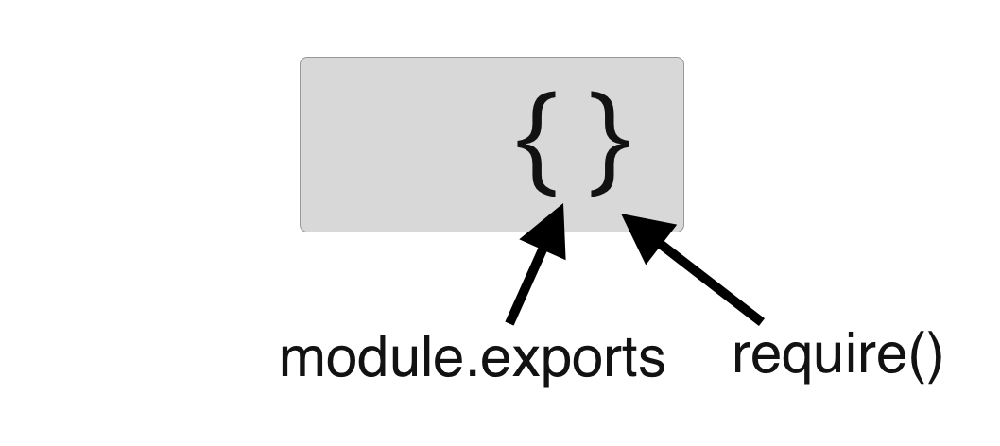
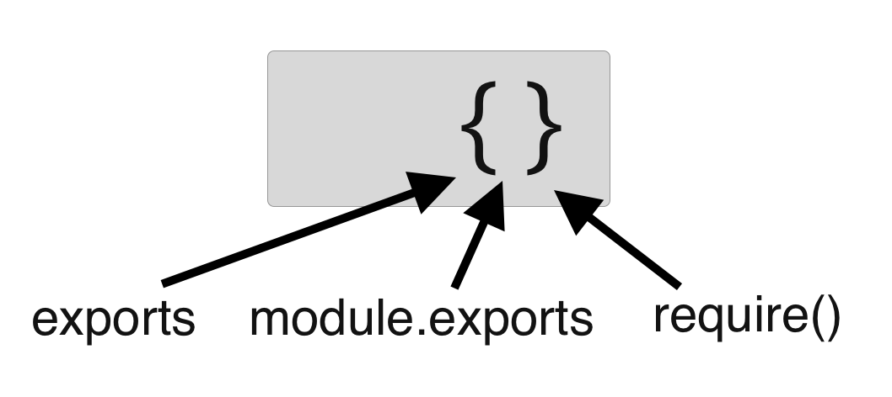

One important concept to grasp in Node.js is the use of `require`, `module.exports` and `exports`. The Node runtime extends Javascript with file I/O and the ability to export files and use their functionality in other files, which is how it achieves modularity.

As of ES6, the Javascript core achieves the same but with slightly different implementation and the keywords `import` and `export`. Things may change in the future, but for now Node uses its own implementation.

## The inner workings

Let’s start with a basic example: a module with a function to calculate the circumference of a circle and another one that uses this function through `require`. Run the example with `node index` to see the console outputs.

`circle.js`
```js
module.exports.circumference = radius => 2 * Math.PI * radius;

console.log(module);

/* Partial console output:
Module {
  id: '/path/to/circle.js',
  exports: { circumference: [Function] },
  parent:
    Module {
      id: '.',
      filename: '/path/to/index.js' },
  filename: '/path/to/circle.js',
  children: []
}
*/
```

`index.js`
```js
const circle = require('./circle');

console.log(circle);  
// { circumference: [Function] }

console.log(circle.circumference(4));  
// 25.13

console.log(module);
/* Partial console output:
Module {
  id: '.',
  exports: {},
  parent: null,
  filename: '/path/to/index.js',
  children:
    [ Module {
      id: '/path/to/circle.js',
      exports: [Object],
      parent: [Circular],
    }]
}
```

What happens here, step by step?

* All files that are executed by nodejs first get a `module` object, which will always be available to you. It contains information for `id` and `filename`.

* The `exports` property of this object is initiated with a reference to an empty object `{}`

* Being a just a plain javascript object, you can assign its properties like we do in the first line: `module.exports.prop = ...`.

* The `require()` function is used to build a hierarchy between `parent` and `children`, which is also registered in the `module` object.

* The `require('./requiredfile')` function returns a reference to the **same object** as the module.exports property of the required file.

You can think of require being naively defined in the following way:

```
const require = path => {
    // ...
    return module.exports;
};
```



We can do a little experiment do demonstrate that `require()` and `module.exports` do in fact point to the same object.

`index.js`
```js
const circle = require('./circle');
console.log(circle)
// { circumference: [Function] }

circle.area = radius => Math.PI * radius * radius;

const newCircle = require('./circle');
console.log(newCircle)
// { circumference: [Function], area: [Function] }
```

As before, we create the reference named `circle` in our index file by requiring the circle module. This time we add an `area` function to `circle` object and again require the circle module. It turns out that the `module.exports` now contains the newly added property as well (because both refer to the same object).

### Aside: How does node create the module?

You can debug your application to view the node source code that takes care of creating a module. It is found in the `loader.js`, specifically the `Module.wrap` function. Here is what happens:

```js
(function (exports, require, module, __filename, __dirname) {

    // YOUR CODE GOES HERE

});
```

It basically reads the file contents, places it inside a constructor function, and executes that function.

## exports vs module.exports

Node provides the shortcut `exports`. This is a reference to the same object as `module.exports` — and the result of `require()` — point to. Nothing magic. You can think of it as an explicit:

```js
let exports = module.exports;
```



Yet it should be used with care, because in javascript it is fundamentally different to assign properties to an object or to assign a new value to a variable. In the second case a new value will be created in memory and the variable will hold a reference to that value.

In short, when you do `exports = someValue` it will no longer share a reference with `module.exports`. Now when `require()` creates a reference, it will be to same object as `module.exports` and not to the value referenced by `exports` any more.

Perhaps best illustrated in another code example:

`circle.js`
```js
exports.circumference = radius => 2 * Math.PI * radius;
exports.area = radius => Math.PI * radius * radius;
console.log(exports === module.exports);
// true

exports = "Look I am a circle!"
console.log(exports === module.exports);
// false
```

`index.js`
```js
const circle = require('./circle');

console.log(circle)
// { circumference: [Function], area: [Function] }
```


The rule of thumb is to never assign a new value to exports (but assigning to exports.someProperty is just fine).

## References

* [lazlojuly: Node.js module.exports vs. exports](https://medium.freecodecamp.org/node-js-module-exports-vs-exports-ec7e254d63ac)

* [https://www.sitepoint.com/understanding-module-exports-exports-node-js/](https://www.sitepoint.com/understanding-module-exports-exports-node-js/)

* [https://stackoverflow.com/questions/7137397/module-exports-vs-exports-in-node-js](https://stackoverflow.com/questions/7137397/module-exports-vs-exports-in-node-js)
