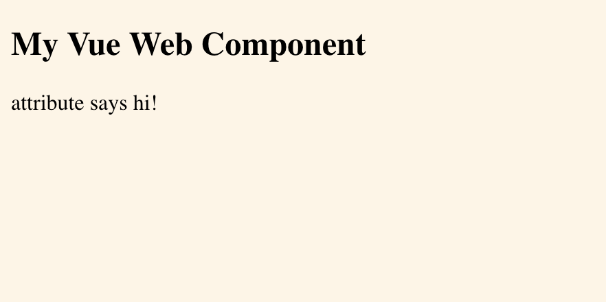
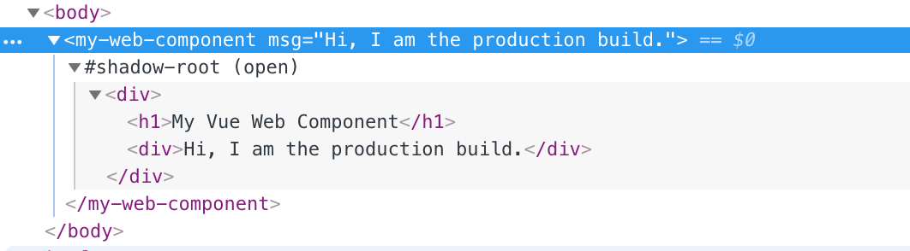

I found the official documentation somewhat wanting, so here is a short guide to building web-components with Vue. It’s actually pretty easy to set up your environment correctly using Vue CLI 3.

Let’s build a web component named `<my-web-component>` that consumes a `msg` attribute. Nothing fancy. Here are the steps:

1. Set up the project
1. Start with a Vue component
1. Wrap up as a webcomponent
1. Build for production
1. Inspect the results
1. Style your component
1. Applying styles in development
1. Results and source code

### 1. Set up the project

Make sure you have the Vue command line tools installed.

```bash
npm install -g @vue/cli
vue --version
# should be 3.x
```

Create a new Vue project with default settings.

```bash
vue create web-component-project
> default (babel, eslint)

cd web-component-project
```

The default Vue environment comes with the *vue-cli-service* plugin. This plugin can serve your project with a development webserver that supports *hot-module-replacement* or building your web component for production.

### 2. Start with a Vue component

Add the following Vue component to `src/components`. It should be no different from a normal Vue component. It takes a `msg` property and interpolates it to the template.

`src/components/MyWebComponent.vue`
```html
<template>
  <div>
    <h1>My Vue Web Component</h1>
    <div>{{ msg }}</div>
  </div>
</template>

<script>
  export default {
    props: ['msg'] 
  }
</script>
```

### 3. Wrap up as a web component

To make your Vue component into a web component, we can simply wrap it in the *@vue/web-component-wrapper* library. This wrapper interfaces it with web component APIs and automatically proxies properties, attributes, events, and slots.

To serve the web component in development, we can do the wrapping in the main.js file and use the component in the index.html file. Update these files to read:

`src/main.js`
```js
import Vue from 'vue';
import wrap from '@vue/web-component-wrapper';
import MyWebComponent from './components/MyWebComponent';

const WrappedElement = wrap(Vue, MyWebComponent);

window.customElements.define('my-web-component', WrappedElement);
```

`public/index.html`
```html
<!DOCTYPE html>
<html lang="en">
  <head>
    <meta charset="utf-8">
    <meta http-equiv="X-UA-Compatible" content="IE=edge">
    <meta name="viewport" content="width=device-width,initial-scale=1.0">
    <title>My Vue web component</title>
  </head>
  <body>
    <noscript>You need javascript.</noscript>
    <my-web-component msg="attribute says hi!"></my-web-component>
  </body>
</html>
```

Now run the development server to view the `my-web-component` in action:

```
npm run serve
```

Visit [127.0.0.1:8080](http://127.0.0.1:8080/) to see the page. It should look like this:



### 4. Build for production

The production build will be slightly different. Without using `main.js`, the `vue-cli-service` itself will wrap the web component by using the `--target wc` option.

Update the `package.json` file to read:

```json
"scripts": {
    "serve": "vue-cli-service serve",
    "build": "vue-cli-service build  --target wc --name my-web-component ./src/components/MyWebComponent.vue",
}
```

This will create a build that is optimized for deployment and does **not** include the core vue library. The rationale is that there can typically be multiple web components on a website and packaging the Vue library with every instance would be a waste of resources. Let’s build it:

```bash
npm run build
```

The `dist` folder should now have at least the following files:

* `my-web-component.js`
* `demo.html`

The `html` file demonstrates the use of your web component. Add a msg attribute to <my-web-component> and open it in the browser. Note that the Vue library is added separately.

```html
<meta charset="utf-8">
<title>my-web-component demo</title>
<script src="https://unpkg.com/vue"></script>
<script src="./my-web-component.js"></script>

<my-web-component msg="Hi, I am the production build."></my-web-component>
```

## 5. Inspect the results

Inspect `my-web-component.js` to see how it is constructed. Near the end of the file, you should see the following line:

```js
window.customElements.define('my-web-component', vue_wc_wrapper(external_Vue_default.a, MyWebComponentshadow))
```

This uses the `define()` method of the browser’s custom elements registry to register our custom `my-web-component` element. But first the Vue component is wrapped inside a web component wrapper, just as we did manually for the development build.

The browser DOM should reflect the shadow DOM that was inserted inside the custom element. Note the `#shadow-root`



## 6. Style your component

Styles can be added just as you would on a conventional Vue component with the `<style>` tag. The style will be automatically scoped to the web component and none of the document styles will bleed into the web component, vice-versa (this is a feature of the shadow DOM). Note: do not confuse the web component *shadow DOM* with the *virtual DOM* of javascript frameworks such as Vue.

`MyWebComponent.vue`
```html
<template>
  <section>
    <h1>My Vue Web Component</h1>
    <div>{{ msg }}</div>
  </section>
</template>

<script>
  export default {
    props: ['msg'] 
  }
</script>

<style>
h1 {
  color: green;
}
section {
  background-color: oldlace;
  margin-bottom: 4rem;
}
</style>
```

```bash
npm run build
```

The style is incorporated into the web component, as we should expect.

### 7. Applying styles in development

The same is not not automatically true for the development setup. Contrary to the results of wrapping in the build script, our custom code in the `main.js` file will add the styles to the document head. Since the shadow DOM is by nature isolated from the document, the styles will not be applied to the web component. Observe by running:

```
npm run serve
```

The solution [as described here](https://github.com/vuejs/vue-web-component-wrapper/issues/12#issuecomment-385141573), is to set the correct shadowMode option in `vue-loader` and `vue-style-loader`. Turns out shadowMode is set false [by default](https://vue-loader.vuejs.org/options.html#shadowmode) in a Vue CLI project, but we can tweak that in [vue.config.js](https://cli.vuejs.org/config/#vue-config-js).

First [inspect the Webpack config](https://cli.vuejs.org/guide/webpack.html#inspecting-the-project-s-webpack-config) to determine which loaders to change:

```bash
# run at project root
vue inspect
```

The result should [resemble this](https://gist.github.com/snirp/07ac6bfa9b007c14fb62773879d1f54e). From that, we can extract a list of occurrences of the `shadowMode: false` option. We can use this list to update the webpack config through `vue.config.js` (create it in the project root, if it not already exits).

```js
function enableShadowCss(config) {
  const configs = [
    config.module.rule('vue').use('vue-loader'),
    config.module.rule('css').oneOf('vue-modules').use('vue-style-loader'),
    config.module.rule('css').oneOf('vue').use('vue-style-loader'),
    config.module.rule('css').oneOf('normal-modules').use('vue-style-loader'),
    config.module.rule('css').oneOf('normal').use('vue-style-loader'),
    config.module.rule('postcss').oneOf('vue-modules').use('vue-style-loader'),
    config.module.rule('postcss').oneOf('vue').use('vue-style-loader'),
    config.module.rule('postcss').oneOf('normal-modules').use('vue-style-loader'),
    config.module.rule('postcss').oneOf('normal').use('vue-style-loader'),
    config.module.rule('scss').oneOf('vue-modules').use('vue-style-loader'),
    config.module.rule('scss').oneOf('vue').use('vue-style-loader'),
    config.module.rule('scss').oneOf('normal-modules').use('vue-style-loader'),
    config.module.rule('scss').oneOf('normal').use('vue-style-loader'),
    config.module.rule('sass').oneOf('vue-modules').use('vue-style-loader'),
    config.module.rule('sass').oneOf('vue').use('vue-style-loader'),
    config.module.rule('sass').oneOf('normal-modules').use('vue-style-loader'),
    config.module.rule('sass').oneOf('normal').use('vue-style-loader'),
    config.module.rule('less').oneOf('vue-modules').use('vue-style-loader'),
    config.module.rule('less').oneOf('vue').use('vue-style-loader'),
    config.module.rule('less').oneOf('normal-modules').use('vue-style-loader'),
    config.module.rule('less').oneOf('normal').use('vue-style-loader'),
    config.module.rule('stylus').oneOf('vue-modules').use('vue-style-loader'),
    config.module.rule('stylus').oneOf('vue').use('vue-style-loader'),
    config.module.rule('stylus').oneOf('normal-modules').use('vue-style-loader'),
    config.module.rule('stylus').oneOf('normal').use('vue-style-loader'),
  ];
  configs.forEach(c => c.tap(options => {
    options.shadowMode = true;
    return options;
  }));
}

module.exports = {
  // https://cli.vuejs.org/guide/webpack.html#chaining-advanced
  chainWebpack: config => {
    enableShadowCss(config);
  }
}
```

With this in place, once again run the development server:

```bash
npm run serve
```

The Vue webpack config would be helped by having a default setting for the `shadowMode`, so you would normally have to configure only that value. Check the [feature request](https://github.com/vuejs/vue/issues/9202) for the status.

### 8. Results and source code

Live instance: [https://snirp.github.io/vue-web-component/](https://snirp.github.io/vue-web-component/)

Source code: [https://github.com/snirp/vue-web-component](https://github.com/snirp/vue-web-component)

## Credit

I received some great help from [tony19 at stackoverflow.com](https://stackoverflow.com/questions/53431754/styling-not-applied-to-vue-web-component-during-development) in figuring out the configuration for the development setup.
