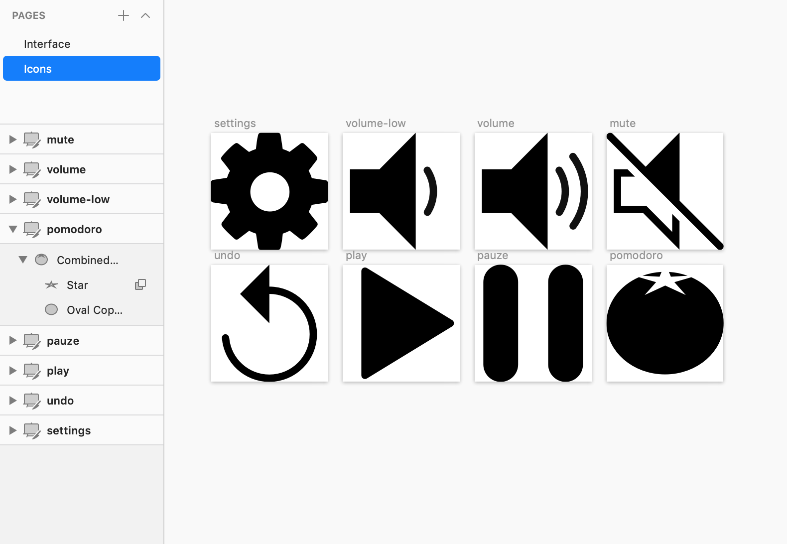
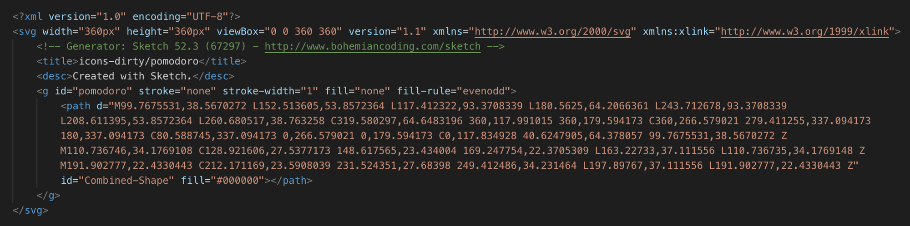
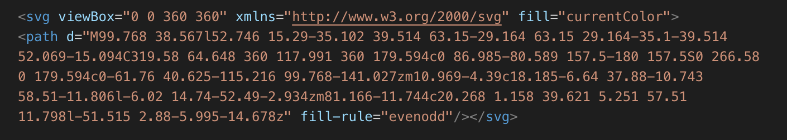
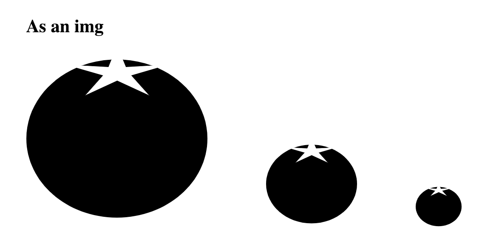
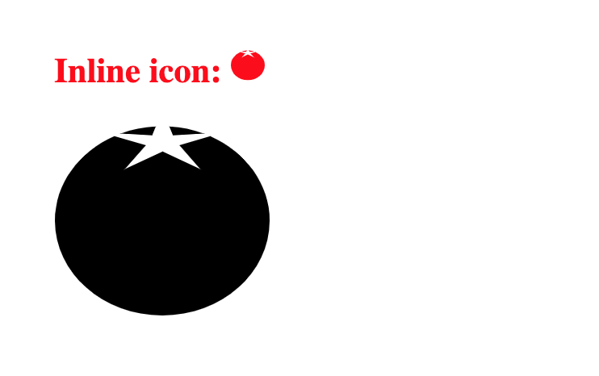

Sketch is a great app that allows you to quickly mock up your user interface, from wireframe to actual graphical design. Until recently I found myself often using stock “font icons”, such as FontAwesome, in that design.

I know icon fonts are suboptimal for several reasons:

* Not suited for screen readers and other accessibility issues;
* Not reliable, resulting in missing icons in some browsers and under certain conditions;
* Large bundle size;
* Issues with hinting and alignment;
* Not all required icons will be available, necessitating a suboptimal fallback or the addition of custom icons;
* You will never get a customized look;

Your custom SVG icons can be the solution to all this, and I have to admit that it was purely out of convenience that I kept using FontAwesome. Let’s see how convenient custom SVG’s can be.

## 1. Design icons

In your sketch file, create a new Page and name it `Icons`. Every icon will get its own artboard. Its name should be descriptive and will be equal to the eventual filename. You can employ all your usual techniques for designing icons (including combined shapes).

Later on, you can style the `fill` and `stroke` of your SVG paths with CSS. I tend to create monochrome icons that only have black fills (no borders), so it becomes easy to manipulate the color. The following command can come in handy:

```
Layer > Convert to Outlines
```

The exact dimensions are not really important when dealing with vector drawings. I prefer square artboards of 360 units. That number is [highly composite](https://en.wikipedia.org/wiki/Highly_composite_number), meaning that it allows for a lot of equal subdivisions (24 actually) and it is generally large enough to avoid ‘subpixel’ warnings.



## 2. Export icons

Sketch does a reasonable job at creating SVG’s. Here is how to initially configure your exports.

```
Edit > Select All Artboards
Layer > Make Exportable
```

Change only the following presets:

* Prefix: icons-dirty/
* Format: SVG

The prefix will make sure that the icons will be saved to a folder named `icons-dirty`. The name is a reminder that these should not be used directly in a website. Why? Let’s take a look at the output.

*SVG as exported by Sketch*

Lot of stuff there that is not strictly needed when using an SVG and even some stuff that will be counter-productive. What are the pixel dimensions doing there? Yuk!

## 3. Cleanup icons

Others have noticed the tendency of SVG’s to accumulate cruft and made a [great NodeJS-based tool called SVGO](https://github.com/svg/svgo) - the `O` stands for "optimizer". Install it and create a target folder for the optimized icons:

```
$ npm install -g svgo
$ mkdir icons
```

The default settings are not perfect, but luckily it is highly configurable. Create a settings file (`svgo.yml`) to make the output more to our taste. Here is our wishlist:

* Retain the viewBox attribute, but remove the width and height. This makes for easy scaling.
* Remove the stroke and stroke-width attributes, as we want to work with fills only.
* Move the fill to the SVG element only, so we can easily manipulate it and we are sure to have monochrome icons only.
* Set the fill to currentColor, so the SVG fills will inherit from the current text color by default.

Here is what the `svgo.yml` file should look like to fulfill our wishes:

```yaml
plugins:
  - removeViewBox: false
  - removeDimensions: true
  - addAttributesToSVGElement:
    attributes:
      - fill: currentColor
  - removeAttrs:
    attrs:
      - 'fill'
      - 'fill-rule'
      - 'stroke'
      - 'stroke-width'
```

Note that all these preferences are highly personal, so feel free to modify this configuration (or skip the config step altogether). Now, to optimize all icons in icons-dirty and place them in icons, do:

```bash
$ svgo -f ./icons-dirty -o ./icons --config=svgo.yml

# pomodoro.svg:
# Done in 2 ms!
# 1.117 KiB - 57.5% = 0.475 KiB
```

It is blazing fast and typically compresses the file by more than 50%. Here is the result of the same icon we looked at previously:

*Optimized SVG: only the stuff we need*

## 4. Use icons

### Use as an image

The vector file can be used inside an  tag. This has the advantage that the file can be cached, but the SVG properties cannot be targeted using CSS. It will scale to fit inside the height and width dimensions of the .

```html
<html>
<head>
  <style>
    body {
      padding: 50px;
    }
    img {
      margin-right: 100px;
    }
  </style>
</head>

<body>
  <h1>As an img</h1>
  
  
  
</body>
</html>
```



### Use as a background image

Similarly, you can set the SVG as the url property of the background rule.

```css
.logo {background: url(pomodoro.svg);
```

### Using it “inline”

More interestingly, you can use the SVG code inline, directly in your HTML. This can be nice because the image appears right in the document and doesn’t require an additional HTTP request. Thus it has the same advantages as using a [Data URI](http://css-tricks.com/data-uris/).

It has the same disadvantages too: a potentially “bloated” document, and inability to cache. There are options — both front end and back end — to include the image dynamically and prevent this bloat. The lack of caching will only be a real concern if you use an image in a lot of places.

```html
<html>
<head>
<style>
  body { padding: 50px; }
  h1 {color: red;}
  h1 svg { height: 1em; width: 1em;}
</style>
</head>

<body>
<h1>
  Inline icon: <svg viewBox="0 0 360 360" xmlns="http://www.w3.org/2000/svg" fill="currentColor"><path d="M99.768 .../></svg>
</h1>

<div style="width:200px;">
  <svg viewBox="0 0 360 360" xmlns="http://www.w3.org/2000/svg" fill="currentColor"><path d="M99.768 .../></svg>
</div>

</body>
</html>
```



Both icons take the color as their fill color. The first one is explicitly scaled to 1em, to fit the height of the text, not unlike a font-awesome icon. The second icon has not dimensions set, and will scale to take up the available space in the parent element.

## Finally

Let me know if this works as well for you and if my workflow needs any improvement. The command to remember complete with configuration is:

```bash
svgo -f ./icons-dirty -o ./icons --config='{ "plugins": [ {"removeViewBox":false}, {"removeDimensions":true}, {"addAttributesToSVGElement":{"attributes":{"fill":"currentColor"}}}, {"removeAttrs":{"attrs":["fill","fill-rule"]}}]}'
```

I have it saved to a script file `./optimize-svg.sh` for easy commandline use.
