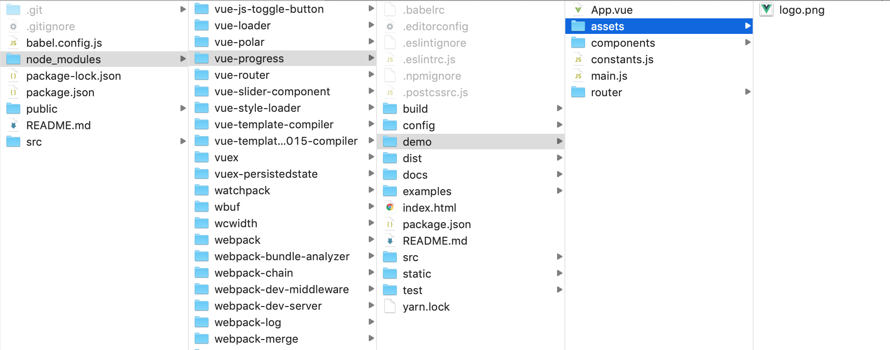

This guide documents the steps to **package**, **publish**, and **version** a Vue component using `vue-cli 3`. We publish to the `NPM` package manager and to the Content Delivery Networks `unpkg` and `jsdelivr` (for use directly in the browser).

> Note: this guide was written after publishing my first (simple) component. It may not suit more complicated cases, or you may find a better guide. I found other guides skimping on versioning & Github integration or not making full use of vue-cli. I intend to expand on this guide in the future to cater for more advanced cases.

## Step 0 — Your Vue project

This step deals with the basic project setup. Feel free to skip ahead for packaging-specific steps.

Create an empty repository on Github.com, install the Vue CLI (if you haven't already), and initiate your project.

```bash
npm install -g @vue/cli
vue create my-project
# use default options
cd my-project
git remote add origin https://github.com/username/my-project.git
git push -u origin master
npm run serve
```

Go about creating your component as you otherwise would. You may want to add a LICENSE file and we will assume the following file structure.

```
package.json
readme.md
LICENSE
src/
    App.vue
    MyComponent.vue
    main.js
dist/
.gitignore
```

## Step 1 — Configure the package.json file

Publishing a library is closer to bookkeeping than to rocket science. It pays to properly set up and document your library. What’s the point if others cannot find it or cannot make sense of it? Or if you don’t fix bugs because the overhead of updating the package is too great?

Edit your `package.json` to resemble:

```json
{
"name": "my-component",
"version": "0.1.0",
"description": "Describes my component",
"author": {
    "name": "My Name",
    "email": "optional@email.com"
},
"repository": "https://github.com/username/project",
"bugs": "https://github.com/username/vproject/issues",
"keywords": ["words", "go", "here"],
"license": "MIT",
"private": false,
"files": ["dist"],
"scripts": {
    "serve": "vue-cli-service serve",
    "build": "vue-cli-service build",
    "build:npm": "vue-cli-service build --target lib --name myComponent src/MyComponent.vue",
},
"main": "dist/myComponent.umd.js",
"unpkg": "dist/myComponent.umd.min.js",

...

}
```

A quick run through the properties:

+ **name** — Name for the package that will appear in NPM.
+ **version** — Semantic version. We will get to that in step 3.
+ **description**, **author**, **repository**, **bugs**, **keywords**, **license** — Additional info for use in NPM.
+ **private** — `true` or `false`. NPM will try to [publish publicly](https://docs.npmjs.com/cli/publish), and that will fail if you have the package set to private.
+ **files** — Determines what files and folders will be published by NPM. If this option is not set, it will look at the `.gitignore` (or `.npmignore`, but we have none) file for inspiration. That will cause your source code and not the built bundles to be published. Exactly the opposite of what we want.
+ **scripts.build:npm** — This is the build script for the package, powered by vue-cli-service: `--target lib` sets the [build target](https://cli.vuejs.org/guide/build-targets.html#library) to a library and `--name myComponent` sets the basic filename.

No harm in trying, so let’s run:

    npm run build:npm

      # Building for production as library (commonjs,umd,umd-min)...

The dist folder should now have the following files inside:

    myComponent.common.js
    myComponent.common.js.map
    myComponent.umd.js
    myComponent.umd.js.map
    myComponent.umd.min.js
    myComponent.umd.min.js.map

You could publish this to NPM and move on to the next challenge in your life. We need a few more steps to do this properly though.


## Step 2 — Add a proper readme

A proper `readme` is very important. Research shows that 65% of potential users will base their view of a library on the readme and 90% will leave frustrated if they cannot find instructions on how to install and use it [I completely made this up].

The readme will be published with your package on npmjs.com and your Github page and should, for a library, answer at least the following questions:

* Can you tell me what problem it solves in two sentences?
* How do I install it?
* How do I use / interact with it?
* Which license is applied?

And optionally:

* What changes were introduced by different versions?
* Can you show me examples of the thing at work?
* How does it work under the hood?
* Project status: builds / tests?
* How can I contribute?
* Which technologies have been used?

Do not get too fancy with lots of content or illustrations. There is value in having a “scannable” document and anything beyond a brief readme is probably better served in actual documentation.

## Step 3 — Versioning

This is one I kept postponing for my own projects, but turn out to be really convenient and easy. NPM even automatically integrates with Git tags, so you do not have to duplicate efforts or even run the risk of your version numbers getting out of sync.

```bash
# Make sure the working directory is clean
git add -A
git commit -m "Changes"

# Increment semantic version with npm
npm version patch -m "Bump the version number"
```

The npm version command stealthily performs two actions:

+ Bump `version` in package.json according to the rules of [semantic versioning](https://semver.org/).
+ Create an [annotated tag](https://git-scm.com/book/en/v2/Git-Basics-Tagging) in Git.

Use the following command to confirm that the tag was created and to push all commits, including the annotated tags to your repository.

```bash
git tag
# v0.1.1
git push --follow-tags
```

## Step 4 — Publish and use

To publish on npmjs.com, you need a free npm account. Create it from the command line:

```bash
npm adduser
```

Login and verify your email to get set up

```bash
npm login
```

Publishing is now easy:

```bash
npm run build:npm
npm publish
```

It should be there (almost instantly), for the whole world to use: `npmjs.com/package/<my-component>`. The search box on [npmjs.com](npmjs.com) should also pick it up immediately.

What’s more, it is available on a CDN so that it can be included in websites. This should be the basic url: `unpkg.com/<my-component>`. That will redirect you to a more specific location complete with version number. The wildcard `latest` will give you the most recent version. Besides `unpkg`, also `jsdelivr` should pick it up automatically. Both services are free and shall offer you little guarantees in terms of uptime or performance, but my experiences have been great so far.

Now all anyone has to do to use your component is:

```bash
npm install my-component
```

or in the browser:

```html
<script src="https://unpkg.com/my-component@latest/dist/myComponent.umd.min.js"></script>
```

## Remark: please no source code in libraries

I have seen libraries that send all the source code, demo files, etc to NPM. Please don’t do that, you are giving NPM a bad name.

+ Packages are for compiled code that is optimized for production
+ Version control systems (such as Github) are for the underlying source code.

*Example of a library that has it all*

Things will go right for you if you have configured “files”: [“dist”] in package.json. Things go wrong with a poorly configured `.npmignore` or with `.gitignore`.

But having access to the source code is a good thing, right? Yes it is, but there are are better ways, such as setting your "repository" in package.json. The link will be there on [npmjs.com](http://npmjs.com) and you can see it on your own system:

```bash
npm show vue repository
```

Change `vue` to any other package you want to inspect. Provided they did their bookkeeping, you will find all the repositories.

## Additional tips

When I tested my own component in the browser (through a CDN), there were two things that bit me. I am mentioning them here, so you will hopefully not fall prey to my rookie mistakes.

+ **Property names with capitals** If your component has composite property names, you are probably camelCasing them. Such as `myProp`. Browser attributes are not case-sensitive and things will go wrong if you use camelCasing. Instead use kebab-casing here, so use `<my-component my-prop="hello">`.
+ **Self closing tags** Unless you serve an `XHTML` document, it is a bad idea to use self-closing tags on empty elements. So you want `<my-component></my-component>` rather than `<my-component />` in `HTML4` and `HTML5`. The second option will result in errors or an unclosed tag.

## References

+ [*VueJS: Packaging Vue Components for npm*](https://vuejs.org/v2/cookbook/packaging-sfc-for-npm.html)
+ [*VueJS: Build Targets — Library*](https://cli.vuejs.org/guide/build-targets.html#library)

